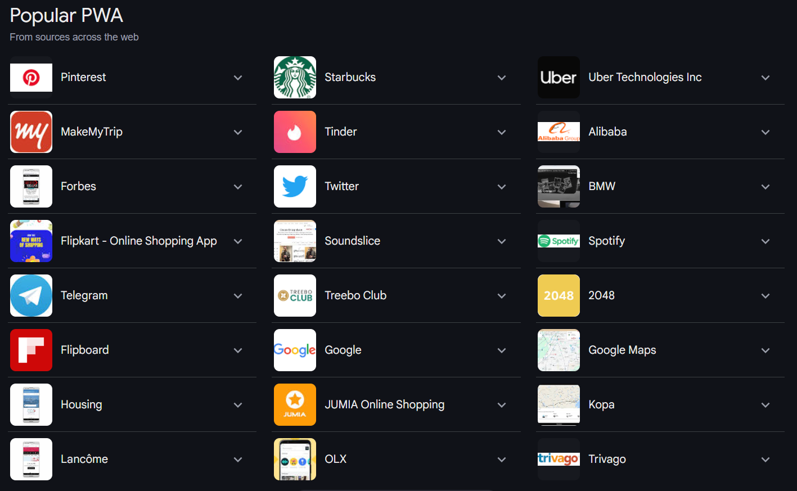
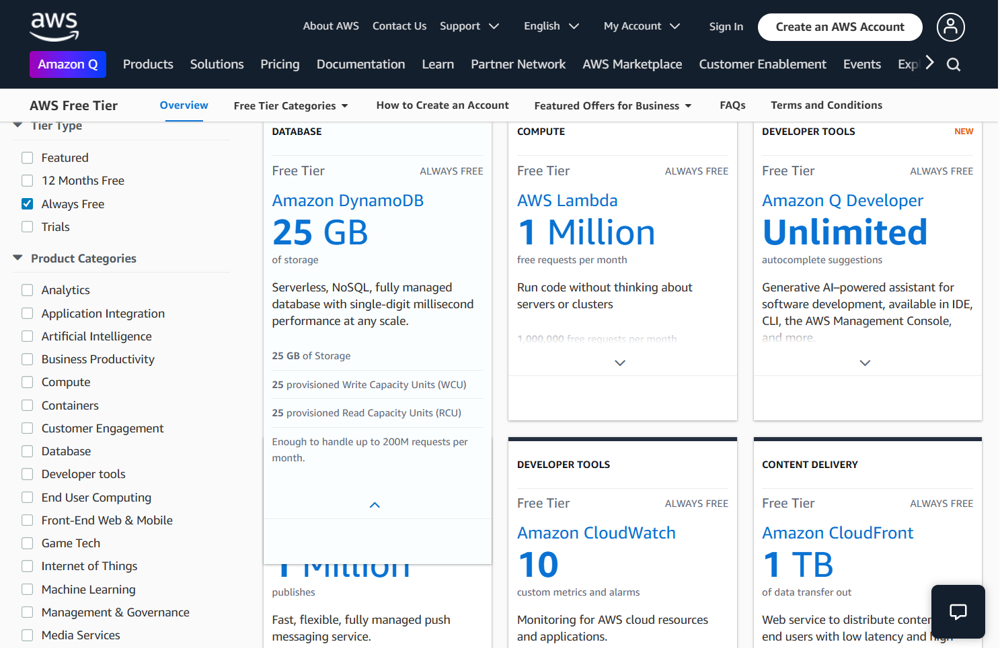
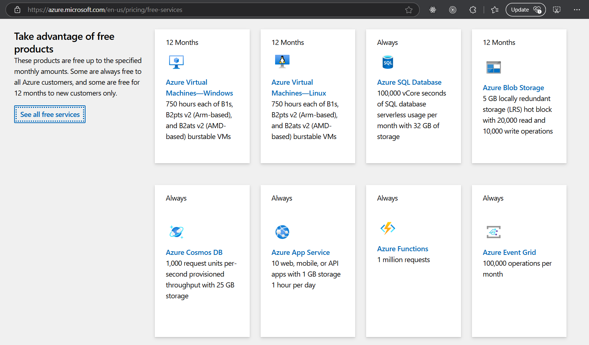
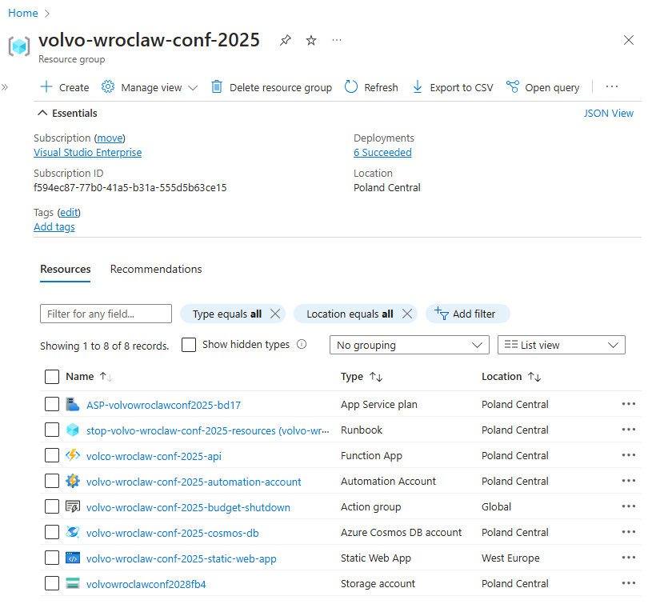

# VolvoWroclawConf2025

This repository showcases how to make a web-page that act as an application, a [Progressive Web App](https://developer.mozilla.org/en-US/docs/Web/Progressive_web_apps/Guides/What_is_a_progressive_web_app) that can be installed on desktops and mobile devices and has capabilities comparable to a native applications.

This is targeted at young software developers who already know basics of programming: at least 1 modern programming language, a general idea of databases and maybe some HTML, now they want to make a useful or fun web / mobile application but are drowning in the abundance of technological choice, struggling to decide between multiple viable solutions for every problem. Experienced devs can also benefit if they are looking for fast app prototyping options.

The app is made with minimal resource overhead in mind (with one notable exception). The goal is to make a prototype as quickly as possible, skipping any non-essential step and taking every possible shortcut. This application is built for rapid deployment to modern cloud for less than 5$ per month.

## Progressive web apps

A Progressive Web App ( PWA ) is a web app that can be [installed on users device permanently](https://developer.mozilla.org/en-US/docs/Web/Progressive_web_apps/Guides/Making_PWAs_installable). It offers a lot additional functionality compared to regular web page, like the ability to work offline, but this project mostly uses PWA because it looks, feels and behaves like a native (i.e. mobile iOS or Android) application and because installation is required to receive push-notifications on some platforms.

PWAs have a major advantage over modern day native mobile apps - PWAs don't have to go through platform-dependant application stores. No need to wait for approval on every update, no need to follow arcane platform rules. The downside is - they are often 2-nd priority for the the company which owns the platform compared to the native aps. Nevertheless, PWA technology is mature and widespread these days, having the benefit of being free and company-neutral to it's advantage which lead to it's mass adoption.



A typical PWA is made with JavaScript/TypeScript and one of the leading [Single Page Application](https://developer.mozilla.org/en-US/docs/Glossary/SPA) frameworks like Angular / React / SolidJS / Svelte etc... However, modern web browsers have become full fledged application platforms in the last 15 years and one of their key new capabilities is [Web Assembly](https://webassembly.org/) or WASM. WASM is one of the latest aspirant on the arena of Virtual Machines (like JVM, CLR or LLVM), it is designed as a portable compilation target for programming languages and let's you create web applications and by extension PWAs with a variety of programming languages like Python, Rust, C# etc... JavaScript still remains "Lingua franca" of modern web, and is primary choice for PWAs, but making both UI and Server part in a single language in which you are well proficient has its own advantages. Due to this reason, I have gone away from "shortest path" rule here and decided to showcase a Blazor PWA made in C#. You will never be able to get rid of JS completely in a PWA, but WASM will allow you to limit it to technical glue-code and make business logic in your language of choice.

## Modern Cloud and development ecosystem 

Modern cloud is incredibly powerful and efficient. So efficient in fact, that Cloud providers are not just wiling to give you free credits for a trial but also give you considerable resources for free permanently. 





They give you Enterprise grade stuff for free and in return they get a highly motivated professional developer familiar with their technology - both sides win. If you look around, you will find that many PaaS providers have generous free tiers these days.

It is also for this reason, that companies like Microsoft and Jetbrains provide "Community" editions of their premier IDEs free of charge to non-commercial users (you just need to register a free account). For this project I recommend downloading [Visual Studio Community](https://visualstudio.microsoft.com/vs/community/), for which you will need an Microsoft Account [outlook.live.com](https://www.microsoft.com/en-us/microsoft-365/outlook/email-and-calendar-software-microsoft-outlook). This account will also be used to access [Azure Cloud](https://portal.azure.com/). 

Another account you will need is with [Google](https://accounts.google.com/) which you will use to access Firebase Cloud.  

## Setting up main Azure cloud

_please note, that newly created/modified Azure Resource take a few minutes to be visible to other Azure Resources. If something is not showing up in a dropdown where you expect it - give it 2-3 minutes and restart the process._

First thing you will need to do is [create an Azure Cloud Resource Group](https://learn.microsoft.com/en-us/azure/azure-resource-manager/management/manage-resource-groups-portal#create-resource-groups). Resource Groups are arbitrary containers that group your Cloud resources together to easily manage their costs and budget alarms. You can have multiple Resource Groups, it's up to you, what kind of logics to use to group resources, it does not restrict any connectivity or interaction between them. You do, however, need to decided on the preferred physical location (data center region). In a multi-region cloud you can easily spread your resources across different location and this **will** affect both their interactions and latency. For your first project - just choose a data-center closest to you and keep everything there. 

The first thing we will [create is a ComsosDB account with activated lifetime free tier](https://learn.microsoft.com/en-us/azure/cosmos-db/free-tier). CosmosDB is a very flexible DB Platform that can host several different flavors of NoSQL (Document), SQL or Graph DBs. We will be using NoSQL version because it allows us to make our model as we go - we do not have to define table schemas or indexes upfront, instead our C# code will contain all our entity definitions. CosmosDB NoSQL api also provides one of the more generous free tier propositions in which you get 1000 RU/s (RequestUnits/Second). This is roughly equivalent to 1 dedicated CPU core. During / after creation go through the options in your newly create DB and make sure that it's set to limit throughput to the free 1000 RU/s. This limiter is not perfect - you can still incur charges of a few cents per hour during super-peek load, but that kind of load is a good problem to have - you're a victim of your own success 😉. 

Next we will [create our API - Azure Functions with Consume Tier](https://learn.microsoft.com/en-us/azure/azure-functions/functions-create-function-app-portal?pivots=programming-language-csharp). Make sure it uses the "Consumption" Tier. "Serverless" functions are the simplest possible way to run code on an HTTP request. In general - they are the simplest possible way to run code in response to many different kind of events - timers, queue messages, DB writes, [etc...](https://learn.microsoft.com/en-us/azure/azure-functions/functions-triggers-bindings?tabs=isolated-process%2Cnode-v4%2Cpython-v2&pivots=programming-language-csharp#supported-bindings). We will use this Azure Function resource to handle both User API and Admin API.  

The last remaining resource we will make is hosting four our PWA - a [Static Web App](https://portal.azure.com/#view/Microsoft_Azure_Marketplace/GalleryItemDetailsBladeNopdl/id/Microsoft.StaticApp). This resource has almost nothing to configure, apart from choosing "other" as deployment source. 

The final thing you will need is to setup a Budget. Cloud bills are notoriously unpredictable, and while you will mostly be using free-tier resource, a small monthly fee is still required for costs like file storage. Not to mention, that **malicious actors have been known to bombard public APIs with DDOS attacks aimed at artificially raking up the bills**. I recommend setting up a 10$ monthly budget that will shut down API in the group.

Start by creating an [Automation Account](https://learn.microsoft.com/en-us/azure/automation/quickstarts/create-azure-automation-account-portal). In the account, go to "Identity" -> "System assigned", click "Azure role assignments" -> "Add role assignment" and give your Automation Account "Contributor" role in Scope of your Resource Group. Than go to "Process Automation" -> "Runbooks" and create a Powershell Runbook with the following script: 

```powershell
Connect-AzAccount -Identity

Get-AzFunctionApp -ResourceGroupName "volvo-wroclaw-conf-2025" | ForEach-Object { 
    Stop-AzFunctionApp -Force -Name $_.Name -ResourceGroupName "volvo-wroclaw-conf-2025" 
}
```

Save and **Publish** Runbook. Run it once to make sure it stops the Azure Functions. Turn functions back on and [create an Action Group](https://learn.microsoft.com/en-us/azure/azure-monitor/alerts/action-groups) using the Runbook, than go to your Resource Group in Azure, in "Cost Management" -> "Budgets", create a Budget for 10$ and assign the Action Group to it. 

Your resource group should now look like this:



## Further in-depth reading

Some of these topics warrant a whole separate book, maybe even several. Don't try to chase everything at once 

[Infrastructure as code](https://learn.microsoft.com/en-us/azure/templates/) - describing cloud resources to be deployed in a domain language like Bicep (replacement for ARM) or Terraform

[Azure Access Control with RBAC](https://learn.microsoft.com/en-us/azure/role-based-access-control/overview) - controlling access and permissions in Azure Cloud

[Azure CLI / Powershell modules](https://learn.microsoft.com/en-us/cli/azure/) - script automation for Azure 

[Tagging Azure resources](https://learn.microsoft.com/en-us/azure/azure-resource-manager/management/tag-resources) - adding useful discoverable metadata bits to cloud resources like admin email, or responsible department 