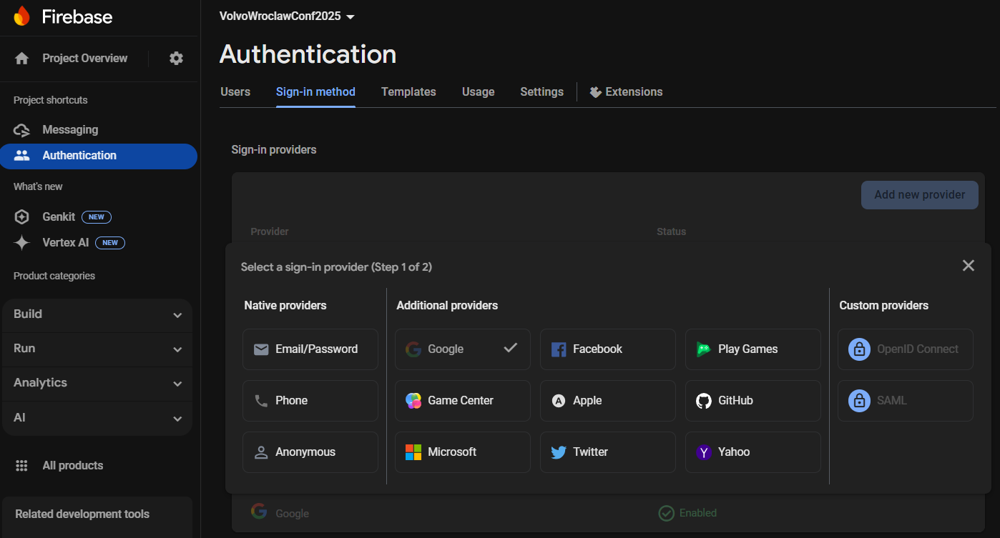

# VolvoWroclawConf2025

This repository showcases how to make a web-page that can act as an application, a [Progressive Web App](https://developer.mozilla.org/en-US/docs/Web/Progressive_web_apps/Guides/What_is_a_progressive_web_app) that can be installed on desktops and mobile devices and has capabilities comparable to a native applications.

Hosted demo is available at [volvo-wroclaw-conf-2025.com](https://volvo-wroclaw-conf-2025.com)

This is targeted at young software developers who already know basics of programming: at least 1 modern programming language, a general idea of databases and maybe some HTML, now they want to make a useful or fun web / mobile application but are drowning in the abundance of technological choice, struggling to decide between multiple viable solutions for every problem. Experienced devs can also benefit if they are looking for fast app prototyping options.

The app is made with minimal resource overhead in mind (with one notable exception). The goal is to make a prototype as quickly as possible, skipping any non-essential step and taking every possible shortcut. This application is built for rapid deployment to modern cloud for less than 5$ per month.

## Progressive web apps

A Progressive Web App ( PWA ) is a web app that can be [installed on users device permanently](https://developer.mozilla.org/en-US/docs/Web/Progressive_web_apps/Guides/Making_PWAs_installable). It offers a lot additional functionality compared to regular web page, like the ability to work offline, but this project mostly uses PWA because it looks, feels and behaves like a native (i.e. mobile iOS or Android) application and because installation is required to receive push-notifications on some platforms.

PWAs have a major advantage over modern day native mobile apps - PWAs don't have to go through platform-dependant application stores. No need to wait for approval on every update, no need to follow arcane platform rules. The downside is - they are often 2-nd priority for the the company which owns the platform compared to the native aps. Nevertheless, PWA technology is mature and widespread these days, having the benefit of being free, company-neutral and able to run on anything with a browser to it's advantage which lead to its mass adoption. 


A typical PWA is made with JavaScript/TypeScript and one of the leading [Single Page Application](https://developer.mozilla.org/en-US/docs/Glossary/SPA) frameworks like Angular / React / SolidJS / Svelte etc... However, modern web browsers have become full fledged application platforms in the last 15 years and one of their key new capabilities is [Web Assembly](https://webassembly.org/) or WASM. WASM is one of the latest aspirants on the arena of Virtual Machines (like JVM, CLR or LLVM), it is designed as a portable compilation target for programming languages and lets you create web applications and by extension PWAs with a variety of programming languages like Python, Rust, C#, Go etc... JavaScript still remains "Lingua franca" of modern web, and is primary choice for PWAs, but making both UI and Server part in a single language in which you are well proficient has its own advantages. Due to this reason, I have gone away from "shortest path" rule here and decided to showcase a Blazor PWA made in C#. I also encourage you to checkout [Go-app (compiles to WASM)](https://github.com/maxence-charriere/go-app), [Java Vaadin (compiles to JS)](https://vaadin.com/) and [Rust Yew (compiles to WASM)](https://github.com/yewstack/yew). You will never be able to get rid of JS completely in a PWA, but you can limit it to technical glue-code that's relegate to interfacing with Browser APIs and make business logic in your language of choice.

*Unless you want to dive deeper into the "works offline" aspect, making your web page into a PWA is just a cherry on top, a way to provide "app experience" to your users. Everything in this article will work just the same for a regular web app / web site. PWA is only required for push-notifications on some mobile platforms.*

## Modern Cloud and development ecosystem 

Modern cloud is incredibly powerful and efficient. So efficient in fact, that Cloud providers are not just wiling to give you free credits for a trial but also give you considerable resources for free permanently. 


They give you enterprise grade stuff for free and in return they get a highly motivated professional developer familiar with their technology - both sides win. If you shop around, you will find that many PaaS providers have generous free tiers these days.

It is also for this reason, that companies like Microsoft and Jetbrains provide "Community" editions of their premier IDEs free of charge to non-commercial users (you just need to register a free account). For this project I recommend downloading [Visual Studio Community](https://visualstudio.microsoft.com/vs/community/), for which you will need an Microsoft Account [outlook.live.com](https://www.microsoft.com/en-us/microsoft-365/outlook/email-and-calendar-software-microsoft-outlook). This account will also be used to access [Azure Cloud](https://portal.azure.com/). 

Another account you will need is with [Google](https://accounts.google.com/) which you will use to access Firebase Cloud.  

## Setting up main Azure cloud

_please note, that newly created/modified Azure Resource take a few minutes to be visible to other Azure Resources. If something is not showing up in a dropdown where you expect it - give it 2-3 minutes and restart the process._

_If you are already familiar with Azure cloud, you can simply deploy provided [Bicep file](./AzureDeployment/_ResourceGroup.bicep)_

First thing you will need to do is [create an Azure Cloud Resource Group](https://learn.microsoft.com/en-us/azure/azure-resource-manager/management/manage-resource-groups-portal#create-resource-groups). Resource Groups are arbitrary containers that group your Cloud resources together to easily manage their costs and budget alarms. You can have multiple Resource Groups, it's up to you, what kind of logics to use to group resources, it does not restrict any connectivity or interaction between them. You do, however, need to decided on the preferred physical location (data center region). In a multi-region cloud you can easily spread your resources across different location and this **will** affect both their interactions and latency. For your first project - just choose a data-center closest to you and keep everything there. 

The first thing we will [create is a CosmosDB account with activated lifetime free tier](https://learn.microsoft.com/en-us/azure/cosmos-db/free-tier). CosmosDB is a very flexible DB Platform that can host several different flavors of NoSQL (Document), SQL or Graph DBs. We will be using NoSQL version because it allows us to make our model as we go - we do not have to define table schemas or indexes upfront, instead our C# code will contain all our entity definitions. CosmosDB NoSQL api also provides one of the more generous free tier propositions in which you get 1000 RU/s (RequestUnits/Second). This is roughly equivalent to 1 dedicated CPU core. During / after creation go through the options in your newly create DB and make sure that it's set to limit throughput to the free 1000 RU/s. This limiter is not perfect - you can still incur charges of a few cents per hour during super-peek load, but that kind of load is a good problem to have - you're a victim of your own success 😉. 

_The following two resources can just as easily be created directly from Visual  Studio when you want to deploy corresponding project for the first time._

Next we will make a hosting four our PWA - a [Static Web App](https://portal.azure.com/#view/Microsoft_Azure_Marketplace/GalleryItemDetailsBladeNopdl/id/Microsoft.StaticApp). This resource has very little to configure, apart from choosing "other" as deployment source. Once it is created - you will get a semi-random generated name for it, and it will not be pretty. The url of this static web app is the only url which your users will actually see, so it makes sense to [attach a custom domain to it](https://learn.microsoft.com/en-us/azure/static-web-apps/custom-domain). You can even buy one directly from Azure if you want to save time (though they are expensive by domain standards - 12$ for a year). 

Now we will [make our API - Azure Functions with Consume Tier](https://learn.microsoft.com/en-us/azure/azure-functions/functions-create-function-app-portal?pivots=programming-language-csharp). Make sure it uses the "Consumption" Tier. "Serverless" functions are the simplest possible way to run code on an HTTP request. In general - they are the simplest possible way to run code in response to many different kind of events - timers, queue messages, DB writes, [etc...](https://learn.microsoft.com/en-us/azure/azure-functions/functions-triggers-bindings?tabs=isolated-process%2Cnode-v4%2Cpython-v2&pivots=programming-language-csharp#supported-bindings). We will use this Azure Function resource to handle both User API and Admin API. Once the resource is provisioned - go to "API" -> "CORS" and add the domain urls used by your Static Web App   

The final thing you will need is to setup a Budget. Cloud bills are notoriously unpredictable, and while you will mostly be using free-tier resource, a small monthly fee may still be required for costs like file storage. Not to mention, that **malicious actors have been known to bombard public APIs with DDOS attacks aimed at artificially raking up the bills**. I recommend setting up a 10$ monthly budget that will shut down API in the group. Please be aware, that usage data in the cloud is available with 8-24 hours and budgets are evaluated every 24 hours, set the budget to 1/2 or 1/3 of the cost you wouldn't mind spending per month. 

Start by creating an [Automation Account](https://learn.microsoft.com/en-us/azure/automation/quickstarts/create-azure-automation-account-portal). In the account, go to "Identity" -> "System assigned", click "Azure role assignments" -> "Add role assignment" and give your Automation Account "Contributor" role in Scope of your Resource Group. Than go to "Process Automation" -> "Runbooks" and create a Powershell Runbook with the following script: 

```powershell
Connect-AzAccount -Identity

Get-AzFunctionApp -ResourceGroupName "volvo-wroclaw-conf-2025" | ForEach-Object { 
    Stop-AzFunctionApp -Force -Name $_.Name -ResourceGroupName "volvo-wroclaw-conf-2025" 
}
```

Save and **Publish** Runbook. Run it once to make sure it stops the Azure Functions. Turn functions back on and [create an Action Group](https://learn.microsoft.com/en-us/azure/azure-monitor/alerts/action-groups) using the Runbook, than go to your Resource Group in Azure, in "Cost Management" -> "Budgets", create a Budget for 10$ and assign the Action Group to it. 

Your resource group should now look like this:


## Setting up Firebase cloud

Firebase Cloud is a specialized cloud offered by Google on top of its normal Google Cloud. Firebase concentrates on services required by applications, mobile, web and others. We will use if for push-notifications and user sign-in with different identity providers (i.e. "Sign in with Google").

Stat by [registering a free account](https://firebase.google.com/) and, [creating your Firebase Project + Application](https://firebase.google.com/docs/web/setup). After that, go to your newly-created App and make  in "Build" -> "Authentication" click "Get Started" to add this functionality to your Firebase App. You will also have to choose and configure Identity provides you want to have in your app on the "Sign-in method" tab. Please note, that most providers will require registration and possible additional setup on their side before they accept sign-in requests from your application. Follow instructions given by Firebase.  



You will also have to go to "Settings" -> "Authorized domains" and add all domains that your app will be using.

Then go to "Run" -> "Messaging" section and make sure it's active for your Firebase App. For messaging you will also have to [create a VAPID key pair](https://firebase.google.com/docs/cloud-messaging/js/client#configure_web_credentials_in_your_app). Its public part will be used by our PWA, private part is not used since we will be using Service Account (next paragraph). 

After you're done setting up - get your [Firebase public config](https://firebase.google.com/docs/web/learn-more) (this can stored openly, since it's given to users anyway) and [Service Account key json file](https://firebase.google.com/docs/admin/setup#initialize_the_sdk_in_non-google_environments) (this must be kept secret, it's used in your server to authorize it to your Firebase account).

## Structure of the project

**DemoPWA** This is the application, itself

**DemoPWA.BFF** This is Backend For Frontend Serverless Function. It exist to be hosted together with PWA in the same Azure Static Web App resource. Since it's hosted on the same domain - it can interact with your app, especially its cookies, without being worried about [CORS](https://developer.mozilla.org/en-US/docs/Web/HTTP/Guides/CORS). Overall, [Backend For Frontend](https://learn.microsoft.com/en-us/azure/architecture/patterns/backends-for-frontends) pattern has been gaining tracktion lately, because it helps better structure and separate responsibilities between general APIs and APIs dedicated to Frontend, especially when it comes to security tokens handling (you really don't want to mix Frontend requirements with general API). For us, BFF layer extracts encrypted user id from secure http cookie and passes it to API as a separate HTTP Header. 

UI and BFF are deployed together into our Static Web App thanks to the [Github Action](https://github.com/IKoshelev/VolvoWroclawConf2025/blob/master/.github/workflows/deploy.yml) 

```yaml
      - name: Deploy to Azure SWA
        uses: Azure/static-web-apps-deploy@v1
        with:
          azure_static_web_apps_api_token: ${{ secrets.AZURE_STATIC_WEB_APPS_API_TOKEN }}
          repo_token: ${{ secrets.GITHUB_TOKEN }}
          action: "upload"
          app_location: "DemoPWA"
          api_location: "DemoPWA.BFF"
          output_location: "wwwroot"
```

You can learn more about this deployment [here](https://learn.microsoft.com/en-us/azure/static-web-apps/deploy-blazor?WT.mc_id=blazorstaticwebapps-social-aapowell). The `AZURE_STATIC_WEB_APPS_API_TOKEN` is obtained from our SWA pane in the Azure Portal and stored as a [Github Secret](https://docs.github.com/en/actions/security-for-github-actions/security-guides/using-secrets-in-github-actions). Thanks to the use of `workflow_dispatch:` trigger, our build is triggered manually from Github Actions pane (you could as well configure it to run on every push, but that would include commits that change Server or just readme):


**Server**

This is our actual API, which will connect to the DB. It has two parts. [UserAPI](https://github.com/IKoshelev/VolvoWroclawConf2025/blob/master/Server/UserAPI.cs) contains functions which are called by our BFF. These functions use `AuthorizationLevel.Anonymous` and manually decrypt user id from dedicated header. We use the simplest possible form of encryption - symmetric AES. We can afford it, because encryption and decryption is handled by the same app, we never need to give out the key, and, of course, because we are not a high-profile target ;-).  This key is stored in the [keys](https://github.com/IKoshelev/VolvoWroclawConf2025/tree/master/Server/keys) folder along with our CosmosDB connection string and Firebase key. In a commercial project, you would use Environment Variables, Managed Identities and Azure Key Vault to keep several viable keys and gradually rotate them. But for a single-dev hobby project you can just store all the keys on your machine and [Publish built version of the server directly to Azure](https://learn.microsoft.com/en-us/azure/azure-functions/functions-develop-vs?pivots=isolated#publish-to-azure) . Since your Visual Studio is connected to your Microsoft account - the publish process will guide you through all your available compatible resources and even allow you to create new ones if need be.  

The keys for Aes are generated like this. 
```csharp
var aes = System.Security.Cryptography.Aes.Create();
aes.GenerateIV();
aes.GenerateKey();
File.WriteAllBytes(@".\Server\keys\aes-key.txt", aes.Key);
File.WriteAllBytes(@".\Server\keys\aes-iv.txt", aes.IV);
```

Don't forget to exclude all key files from git change-tracking to avoid accidental commit like this:

```cmd
git update-index --assume-unchanged ./Server/keys/volvowroclawconf2025-firebase-adminsdk-fbsvc-2f3f10f5a2.json
git update-index --assume-unchanged ./Server/keys/db_connection_string.txt
...
```

The next part of our Server are [AdminAPI functions](https://github.com/IKoshelev/VolvoWroclawConf2025/blob/master/Server/AdminAPI.cs) . They handle administrative tasks, like making sure the DB and Containers are properly created after first deploy. You are expected to call them manually and they use function keys provided by Azure for security.  The easiest way to call them is from Azure Portal itself. In your  Function App, you can click a specific function and use "Test/Run" or copy url with key from "Get function URL".


In recent years IDEs started supporting an `.http` file format, which allows you to make a [scratchpad of useful requests in the HTTP syntax itself](https://learn.microsoft.com/en-us/aspnet/core/test/http-files?view=aspnetcore-9.0). From experience - this ends up working a lot better than all the UI tools like Postman and I really urge you to give this a try. The [stub](https://github.com/IKoshelev/VolvoWroclawConf2025/blob/master/Server/requests.http) is already included with the project. 

## DevProxy

This is a proxy for local development that runs on `https://localhost:3000/` and routes `/api` calls to local BFF and all other to PWA. This is needed so that BFF and PWA are on the same Origin Domain (like they will be when deployed), and BFF can set Cookies (CORS Cookies are not allowed). 

## Running everything together locally

You can run the project in its entirety locally using [Azure Cosmos DB Emulator](https://learn.microsoft.com/en-us/azure/cosmos-db/emulator) or even targeting real Azure instance. One of the benefits of storing Server configs and encryption keys in local development folder is that it will run just like deployed version, and you can both access your PROD DB and trigger push-notifications. [Set all 4 projects to run](https://learn.microsoft.com/en-us/visualstudio/ide/how-to-set-multiple-startup-projects?view=vs-2022) for the ultimate seamless debug experience. 

If it's your first time running against a given CosmosDB - execute 

```http
POST http://localhost:7011/api/ensure-db-created
```

and, possibly

```http
POST http://localhost:7011/api/create-mock-users
````


## Final word of warning

PWA were made to make use of cache to work offline. Used wisely, this is a great boon. However, it can also be a great pain, since different platforms will have very different ideas, as to what should be cached and for how long. It may be a good idea for your app to avoid [HTTP caching](https://developer.mozilla.org/en-US/docs/Web/HTTP/Reference/Headers/Cache-Control) completely and instead handle data storage in code via things like [Local Storage](https://developer.mozilla.org/en-US/docs/Web/API/Window/localStorage). 

## Further in-depth reading

Some of these topics warrant a whole separate book, maybe even several. The list of topics goes beyond even full-stack and into one-man-army territory, so don't try to chase everything at once, spend 10 minutes reading on each topic, and then decide, if you need to know more. The harsh reality of modern day development is that it doesn't make sense to learn non-fundamental technologies that you won't use within the next year, since 2-3 years from now it may well be deprecated or todays tutorial outdated.

[Infrastructure as code](https://learn.microsoft.com/en-us/azure/templates/) - describing cloud resources to be deployed in a domain language like Bicep (replacement for ARM) or Terraform

[Azure Access Control with RBAC](https://learn.microsoft.com/en-us/azure/role-based-access-control/overview) - controlling access and permissions in Azure Cloud

[Azure CLI / Powershell modules](https://learn.microsoft.com/en-us/cli/azure/) - script automation for Azure 

[Tagging Azure resources](https://learn.microsoft.com/en-us/azure/azure-resource-manager/management/tag-resources) - adding useful discoverable metadata bits to cloud resources like admin email, or responsible department 

[CosmosDB](https://learn.microsoft.com/en-us/azure/cosmos-db/resource-model) - deeper dive when free-tier is no longer enough and you need to fine-tune performance

[OpenID](https://openid.net/developers/how-connect-works/), [OAuth](https://auth0.com/intro-to-iam/what-is-oauth-2) - authentication and authorization 

[OWASP](https://owasp.org/www-project-top-ten/) - most commonly exploited vulnerability types across all programming languages

[Browser APIs](https://developer.mozilla.org/en-US/docs/Web/API) - you'll be surprised, how much stuff these days can be done with just a web page, not even PWA 

[PWA](https://developer.mozilla.org/en-US/docs/Web/Progressive_web_apps) - capabilities, best practices, etc...

[Responsive design with CSS](https://css-tricks.com/guides/) - make sites that adjust user-experience to device screen dimensions and overall capabilities, as well as user needs / preferences. The most value you will get out of [Flexbox](https://css-tricks.com/snippets/css/a-guide-to-flexbox/), [Grid](https://css-tricks.com/snippets/css/complete-guide-grid/) and [Media-queries](https://css-tricks.com/a-complete-guide-to-css-media-queries/)

[Blazor UI components](https://demos.blazorbootstrap.com/getting-started) - lots of different pre-made widgets for Blazor UI (just one of many offers) 

[Unit Testing](https://learn.microsoft.com/en-us/dotnet/core/testing/unit-testing-best-practices) - an absolute requirement in modern enterprise development
